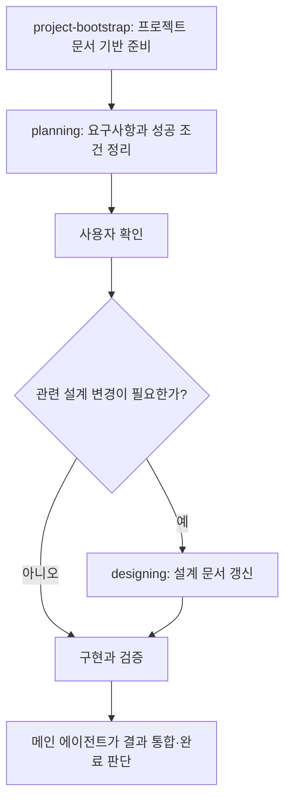

# Codex Efficient Subagents

Codex에서 **요구사항 정리 → 설계 → 구현·검증**을 이어 가고, 독립적인 작업을 subagent에 맡기는 개인 작업 체계를 공유합니다. 공통 지침, 역할 설정, 세 가지 스킬, 프로젝트 문서 템플릿을 함께 제공합니다.

개인 Obsidian Vault나 Google Drive 없이 설치하고 프로젝트 작업을 시작할 수 있습니다. 애플리케이션 코드나 외부 서비스 연결은 포함하지 않습니다.

[전체 흐름](#전체-흐름) · [구성 요소](#구성-요소와-책임) · [빠른 설치](#빠른-설치) · [스킬 description](#스킬-description) · [프로젝트 시작](#프로젝트-시작하기) · [작업 예시](#첫-작업부터-완료까지) · [사용자별 조정](#사용자별-조정) · [문제 해결](#업데이트와-문제-해결)

## 전체 흐름



bootstrap은 프로젝트를 처음 준비하거나 문서 체계를 정돈할 때 사용합니다. 매 작업마다 반복하지 않습니다. 탐색은 방향을 정하는 중에도 위임할 수 있고, 구현 위임은 요구사항과 파일 소유 범위를 정한 뒤 진행합니다.

**작업을 시작할 때 `planning 스킬을 사용해 먼저 방향을 정리해주세요`라고 명시하는 것을 권장합니다.** 자동 선택에만 맡기지 않고 원하는 작업 절차를 분명히 전달할 수 있습니다.

```text
planning 스킬을 사용해주세요.
검색 결과에 필터 기능을 추가하려고 합니다.
기존 구현을 확인하고 목표, 범위, 성공 조건, 미확정 사항을 먼저 정리해주세요.
```

Codex CLI·IDE에서는 `$planning`으로 직접 지정할 수도 있습니다. 스킬은 이름과 description을 바탕으로 자동 선택되기도 합니다. 이 저장소의 planning 스킬과 제품의 Plan mode는 별개입니다. [공식 스킬 안내](https://learn.chatgpt.com/docs/build-skills)

## 구성 요소와 책임

| 구성 | 책임 | 파일 |
|---|---|---|
| 메인 에이전트 | 사용자 소통, 요구사항·설계 판단, 범위와 소유권 결정, 결과 통합 | [공통 지침](instructions/AGENTS.snippet.md) |
| `luna_explorer` | 지정 범위의 읽기 전용 탐색과 근거 수집 | [역할 설정](agents/luna_explorer.toml) |
| `sol_executor` | 합의된 범위의 구현과 검증 | [역할 설정](agents/sol_executor.toml) |
| `planning` | 요구사항 확인부터 구현·평가까지 작업 진행 | [SKILL.md](skills/planning/SKILL.md) |
| `designing` | 승인된 요구사항을 지속적으로 관리할 설계로 구체화 | [SKILL.md](skills/designing/SKILL.md) |
| `project-bootstrap` | 문서 진입점, 작업 저장 위치, playbook 안내 준비 | [SKILL.md](skills/project-bootstrap/SKILL.md) |

짧은 조회나 작은 수정은 메인 에이전트가 직접 처리합니다. 독립적인 작업을 나누는 이점이 있을 때 위임하며, 동시 실행 한도를 채우기 위해 작업을 나누지 않습니다. 전달 형식은 [위임 예시](examples/delegation.md)를 참고하세요.

## 빠른 설치

### 1. 준비와 다운로드

로컬 파일을 읽고 실행할 수 있는 Codex 환경, Git, Python 3.10 이상을 준비합니다. Python은 planning의 작업 문서 유틸리티에 필요하며 표준 라이브러리만 사용합니다. 역할 파일에 지정한 모델을 계정에서 사용할 수 있는지도 확인하세요.

```sh
git clone https://github.com/felrer/codex-efficient-subagents.git
cd codex-efficient-subagents
```

### 2. 설치 범위 선택

여러 프로젝트에서 같은 체계를 사용하려면 전역 설치, 한 프로젝트에서만 사용하거나 팀과 함께 관리하려면 프로젝트 설치를 선택합니다.

| 저장소 내용 | 전역 설치 위치 | 프로젝트 설치 위치 |
|---|---|---|
| `instructions/AGENTS.snippet.md` 내용 | `~/.codex/AGENTS.md`에 병합 | 프로젝트 `AGENTS.md`에 병합 |
| `agents/*.toml` 두 파일 | `~/.codex/agents/` | `.codex/agents/` |
| `config.example.toml` 내용 | `~/.codex/config.toml`에 병합 | `.codex/config.toml`에 병합 |
| `skills/` 안의 세 폴더 전체 | `~/.agents/skills/` | `.agents/skills/` |

`~`는 사용자 홈 폴더입니다. `CODEX_HOME`을 따로 설정했다면 위 표의 `~/.codex`를 해당 경로로 바꿉니다. 스킬 설치 위치인 `~/.agents/skills`와는 구분하세요. 스킬 폴더의 scripts, references, assets도 함께 복사해야 합니다. [공식 스킬 경로 안내](https://learn.chatgpt.com/docs/build-skills)

기존 파일은 먼저 백업하고 비교해 병합하세요. 기존 `[agents]` 섹션이 있다면 중복 생성하지 않고 [설정 예시](config.example.toml)의 항목을 합칩니다. 같은 이름의 스킬이 이미 있다면 사용자 수정과 비교한 뒤 교체합니다. 세 스킬은 같은 `skills` 디렉터리 아래에 형제 폴더로 유지하세요.

Codex에 설치를 맡길 때는 다운로드한 저장소의 실제 경로와 적용 범위를 지정합니다.

```text
이 저장소의 README와 실제 파일을 확인하고 현재 프로젝트에 설치해주세요.
공통 지침과 Codex 설정은 기존 내용에 병합하고,
두 역할 파일과 세 스킬의 전체 폴더를 프로젝트 설치 위치에 배치해주세요.
기존에 같은 이름의 설정이나 스킬이 있으면 차이를 확인하고 사용자 변경을 보존해주세요.
```

### 3. 설치 확인

Codex를 다시 열고 다음을 확인합니다.

- 스킬 목록에서 `planning`, `designing`, `project-bootstrap`의 이름과 description이 보이는지 확인합니다.
- `planning 스킬로 작은 개선 작업의 방향만 정리해주세요`라고 요청해 구현 전에 요구사항과 확인할 내용을 정리하는지 확인합니다.
- 실제 프로젝트 경로를 지정해 `luna_explorer`에 읽기 전용 탐색을 한 번 맡기고 역할·모델·근거 반환을 확인합니다. [확인 예시](examples/delegation.md#설치-후-작은-확인-작업)

## 스킬 description

아래는 배포한 각 `SKILL.md`의 `description` 원문입니다. 에이전트가 스킬의 용도와 사용 시점을 판단하는 메타데이터이므로 본문과 함께 공유합니다.

### planning

> 모든 코드 수정 작업의 진입점입니다. 목표, 해결 방향, 동작 또는 범위에 미확정 사항이 있는 문제 해결·개선 요청에서 요구사항 정리, 사용자 승인, 설계 문서 수정, 구현과 평가까지 진행합니다.

요청과 기존 근거를 확인해 목표·제약·성공 조건을 정리합니다. 사용자 확인이 필요하거나 내용이 많으면 설정된 작업 위치에 brief를 남깁니다. 승인 후 필요한 설계 변경을 연결하고 구현·검증까지 진행합니다. 작업 위치가 없으면 대화에서 정리합니다.

파일: [스킬](skills/planning/SKILL.md) · [작업 문서 규칙](skills/planning/references/task-artifacts.md) · [생성 유틸리티](skills/planning/scripts/work_artifacts.py)

### designing

> 승인된 요구사항을 제품·시스템의 동작과 구조로 구체화하고, 구현과 검토의 기준이 되는 설계 문서를 작성하거나 갱신합니다.

합의된 요구사항을 바탕으로 동작, 데이터 의미, 구성요소의 책임, 실패·충돌 처리와 결정 이유를 담당 설계 문서에 반영합니다. 파일별 수정 목록을 나열하는 실행 계획과 구분합니다.

파일: [스킬](skills/designing/SKILL.md)

### project-bootstrap

> Create or align project documentation entry points, configurable work locations with scripted brief/plan creation, and selective project playbook routing. Use when explicitly bootstrapping or normalizing a project; reuse common playbooks with project-specific adaptations when in scope. Do not generate application scaffolding, detailed designs, or task plans.

새 프로젝트에는 최소 문서 구조를 준비하고, 기존 프로젝트에는 내용을 보존하면서 필요한 진입점과 연결을 보완합니다. description은 개인 원문의 표현을 보존했습니다. 그중 `brief/plan` 표현과 달리 배포본의 작업 문서 규칙은 현재 planning의 세션별 번호가 붙은 brief 체계로 통일했습니다.

파일: [스킬](skills/project-bootstrap/SKILL.md) · [프로젝트 템플릿](skills/project-bootstrap/assets/project-template/)

## 프로젝트 시작하기

작업할 프로젝트를 Codex에서 연 뒤 요청합니다.

**새 프로젝트**

```text
project-bootstrap 스킬로 이 프로젝트의 문서 기반을 준비해주세요.
작업 문서는 docs/work에 저장하고, 애플리케이션 코드는 아직 만들지 마세요.
```

**기존 프로젝트**

```text
project-bootstrap 스킬로 기존 문서와 지침을 확인해주세요.
기존 구조와 내용을 보존하며 필요한 문서 진입점과 작업 저장 위치를 정돈해주세요.
```

새 프로젝트의 기본 구조입니다. 기존 프로젝트는 같은 역할을 맡는 문서가 있으면 재사용합니다.

```text
AGENTS.md
docs/
  README.md               # 문서 탐색과 Work directory 설정
  architecture/README.md  # 동작·구조·계약을 담을 설계 문서 안내
  maps/README.md          # 구현 위치와 관계 안내
  ops/README.md           # 실행·검증·운영 절차 안내
  playbooks/README.md     # 작업 유형별 지침 선택
  work/README.md          # 작업 기록 사용 규칙
```

bootstrap은 문서 진입점을 준비합니다. 상세 설계와 작업 brief는 실제 작업이 생길 때 작성합니다. 공통 playbook 본문은 이 배포에 포함하지 않으며, 필요한 경우 사용자가 제공한 자료에서 해당 프로젝트에 맞는 것만 가져옵니다.

## 첫 작업부터 완료까지

검색 필터를 추가한다면 다음과 같이 진행합니다.

1. **방향 정리:** `planning 스킬로 검색 필터 추가 방향을 먼저 정리해주세요.` 기존 검색 구조, 필터 조건, 성공 조건과 미확정 사항을 확인합니다.
2. **피드백과 승인:** 제안된 동작을 검토하고 `이 범위로 진행해주세요`처럼 확정합니다. 수정 의견은 같은 brief에 반영합니다.
3. **설계 반영:** 기존 설계의 변경이 필요하면 designing으로 담당 문서를 갱신합니다. 절차를 채우기 위한 설계 문서를 새로 만들지는 않습니다.
4. **구현과 검증:** 메인 에이전트가 직접 수행하거나, 독립적인 범위와 파일 소유권을 정해 subagent에 맡깁니다.
5. **결과 확인:** 변경 내용, 검증 범위·결과, 남은 제한을 확인합니다.

작업 위치가 설정되어 있고 brief가 필요한 경우의 예시입니다. 폴더 이름은 유틸리티가 할당하므로 직접 번호를 계산하지 않습니다.

```text
docs/work/AA-01-search-filter/
  01-brief.md  # 첫 작업의 요구사항과 피드백
  02-brief.md  # 같은 세션에서 별개 후속 작업이 생겼을 때
```

같은 작업의 피드백은 기존 brief를 갱신합니다. 별도 작업 세션은 새 폴더를 사용합니다. 설계 문서는 작업 기록과 분리해 관련 기능의 설계를 계속 관리합니다.

## 사용자별 조정

| 항목 | 기본값과 변경 위치 |
|---|---|
| 탐색 역할 | `luna_explorer`: `gpt-5.6-luna`, `high` |
| 구현 역할 | `sol_executor`: `gpt-5.6-sol`, `medium` |
| 동시 실행 한도 | `config.example.toml`의 8. 실제 작업량과 비용에 맞게 조정 |
| 작업 문서 위치 | 프로젝트 `docs/README.md`의 `## Work Artifacts` 아래 `Work directory` |
| 프로젝트 작업 지침 | 프로젝트의 `docs/playbooks/README.md`를 통해 필요한 문서만 연결 |

모델과 추론 수준은 각 역할 TOML의 `model`, `model_reasoning_effort`에서 변경합니다. 위 값은 이 저장소의 프리셋이며 모든 계정의 모델 접근을 보장하지 않습니다. 메인 에이전트의 모델은 사용하는 Codex 환경에서 선택합니다.

작업 위치는 planning 유틸리티의 `configure`로 변경할 수 있습니다. 이 명령은 설정과 안내 링크를 바꾸며 기존 작업 기록을 이동하지 않습니다. 구체적인 명령은 [작업 문서 규칙](skills/planning/references/task-artifacts.md)을 따릅니다.

## 업데이트와 문제 해결

업데이트할 때는 `git pull`로 배포본을 받은 뒤 설치한 파일과 비교해 병합합니다. 복사 설치한 파일은 자동으로 동기화되지 않습니다. 변경 기록은 [CHANGELOG](CHANGELOG.md)에 있습니다.

| 증상 | 확인할 내용 |
|---|---|
| 스킬이 보이지 않음 | 설치 범위, 폴더 안의 SKILL.md, name/description, Codex 재시작 |
| 동일 스킬이 두 개 보임 | 전역·프로젝트에 같은 이름으로 중복 설치했는지 |
| subagent 실행 실패 | 역할 파일 인식, 설정 병합, 지정 모델 접근, 실행 환경의 위임 지원 |
| brief 생성 실패 | Python 실행 가능 여부, 작업 위치 설정, 해당 경로의 쓰기 권한 |
| bootstrap 참조 파일이 없음 | 세 스킬이 형제 폴더인지, scripts/references/assets를 함께 복사했는지 |

이 저장소는 프롬프트와 작업 규칙을 공유합니다. 토큰 절감률이나 모든 환경에서 동일한 실행 결과를 보장하는 벤치마크는 아닙니다. 설정 형식과 실행 환경 차이는 [공식 subagent 안내](https://learn.chatgpt.com/docs/agent-configuration/subagents)를 함께 확인하세요.
